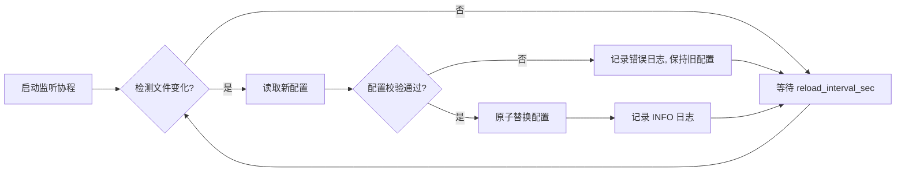

# 需求规格说明书：基于配置的动态 Mock Server

## 1. 项目概述 (Project Overview)

本项目旨在开发一个基于 **Golang** 的轻量级 Mock API Server。
**核心目标**是解耦"代码逻辑"与"模拟数据"。开发者无需修改代码，仅通过修改 `config.yaml` 配置文件，即可定义 API 路由，并根据请求内容（Request Body/Header/Query/Path）中的特定字段值，动态返回不同的 JSON 文件。

**关键特性：**

* **零代码变更**：新增接口或修改返回逻辑只需改配置。
* **动态分流**：支持根据请求参数值（如 `order_id` 或 `type`）返回不同结果。
* **强制兜底**：每个接口必须配置默认响应（Default Response），确保未命中规则时服务的高可用性。
* **路径参数支持**：支持 RESTful 风格的动态路径（如 `/api/v1/user/:id`）。
* **多条件匹配**：支持基于多个字段的组合条件判断。
* **灵活规则**：支持精确匹配、前缀、后缀、正则表达式等多种匹配模式。
* **热加载配置**：修改配置文件后无需重启服务即可生效。

---

## 2. 系统架构流程 (Logic Flow)

```mermaid
graph TD
    A[Client 发起请求] --> B(Server 接收请求);
    B --> C{匹配 URL & Method?};
    C -- No --> D[返回 404 Not Found];
    C -- Yes --> E[解析 Selector];
    E --> F[提取目标字段值];
    F --> G{遍历 Rules 匹配值?};
    G -- 命中规则 --> H[读取 Rule 指定的 JSON];
    G -- 未命中 --> I[读取 Default 指定的 JSON];
    H --> J[应用响应模板替换];
    I --> J;
    J --> K[构建 Response (Status Code + Headers + Body)];
    K --> L[应用延迟 delay_ms];
    L --> M[返回给 Client];

```

---

## 3. 配置文件设计 (Configuration Schema)

配置文件采用 YAML 格式。核心在于 `endpoints` 的定义，每个 Endpoint 必须包含 `selectors`（取值逻辑）、`rules`（匹配逻辑）和 `default`（兜底逻辑）。

### 3.1 示例配置文件 (`config.yaml`)

```yaml
server:
  port: 8080
  hot_reload: true              # 启用配置热加载
  reload_interval_sec: 5        # 热加载检查间隔（秒）
  
  # 日志配置
  logging:
    level: "info"               # debug, info, warn, error
    access_log: true            # 是否记录访问日志
    log_format: "json"          # json, text
    log_file: "./logs/server.log"  # 可选：日志文件路径，不配置则输出到 stdout

  # 错误处理配置
  error_handling:
    show_details: true          # 是否在响应中显示错误详情（开发环境建议开启）
    custom_error_responses:
      404: "./mocks/errors/not_found.json"
      500: "./mocks/errors/internal_error.json"

# 健康检查端点（内置）
health_check:
  enabled: true
  path: "/health"

endpoints:
  # 示例 1: 支付状态查询接口 (多条件匹配 + 正则表达式)
  - path: "/api/v1/payment/status"
    method: "POST"
    description: "根据订单ID和用户类型返回不同的支付结果"
    
    # 1. 取值选择器：支持多个字段组合判断
    selectors:
      - name: "order_id"
        type: "body"              # 可选: body (json), header, query, path
        key: "order_id"           # json path 或 header/query key
      - name: "user_type"
        type: "header"
        key: "X-User-Type"
    
    # 2. 匹配规则：支持多种匹配模式
    rules:
      # 精确匹配
      - conditions:
          - selector: "order_id"
            match_type: "exact"   # exact, prefix, suffix, regex, range
            value: "1001"
        response_file: "./mocks/payment/success.json"
        status_code: 200
        
      # 正则表达式匹配
      - conditions:
          - selector: "order_id"
            match_type: "regex"
            value: "^ERR_[0-9]{4}$"   # 匹配 ERR_0001 格式
        response_file: "./mocks/payment/error_order.json"
        status_code: 400
        
      # 多条件组合匹配 (AND 逻辑)
      - conditions:
          - selector: "order_id"
            match_type: "prefix"
            value: "VIP_"
          - selector: "user_type"
            match_type: "exact"
            value: "premium"
        response_file: "./mocks/payment/vip_success.json"
        status_code: 200
        headers:                   # 自定义响应头
          X-VIP-Status: "active"
          X-Priority: "high"

    # 3. 默认兜底策略 (必填)
    default:
      response_file: "./mocks/payment/default.json"
      status_code: 200
      delay_ms: 0
      headers:
        X-Mock-Server: "true"

  # 示例 2: 用户信息 (路径参数 + Query 参数)
  - path: "/api/v1/user/:user_id"   # 支持路径参数
    method: "GET"
    description: "根据用户ID和类型返回用户信息"
    selectors:
      - name: "user_id"
        type: "path"               # 从路径中提取参数
        key: "user_id"
      - name: "user_type"
        type: "query"
        key: "type"                # URL?type=admin
    rules:
      - conditions:
          - selector: "user_type"
            match_type: "exact"
            value: "admin"
        response_file: "./mocks/user/admin.json"
        status_code: 200
        
      # 范围匹配（数值场景）
      - conditions:
          - selector: "user_id"
            match_type: "range"
            value: "[1, 100]"      # user_id 在 1-100 之间
        response_file: "./mocks/user/test_user.json"
        status_code: 200
        
    default:
      response_file: "./mocks/user/guest.json"
      status_code: 200

  # 示例 3: 动态响应模板
  - path: "/api/v1/order/:order_id"
    method: "GET"
    selectors:
      - name: "order_id"
        type: "path"
        key: "order_id"
    rules: []
    default:
      response_file: "./mocks/order/detail_template.json"
      status_code: 200
      template:                    # 响应模板配置
        enabled: true
        variables:                 # 内置变量 + 自定义变量
          - "{{.order_id}}"        # 来自 selector
          - "{{.timestamp}}"       # 内置：当前时间戳
          - "{{.uuid}}"            # 内置：生成 UUID

  # 示例 4: 随机响应（测试场景）
  - path: "/api/v1/random/status"
    method: "GET"
    selectors: []
    rules: []
    default:
      random_responses:            # 随机响应配置
        enabled: true
        files:
          - file: "./mocks/random/success.json"
            weight: 70             # 70% 概率
            status_code: 200
          - file: "./mocks/random/error.json"
            weight: 20             # 20% 概率
            status_code: 500
          - file: "./mocks/random/timeout.json"
            weight: 10             # 10% 概率
            status_code: 504
            delay_ms: 5000         # 模拟超时

```

---

## 4. 数据结构定义 (Go Structs)

为了准确解析上述 YAML，使用以下 Go 结构体定义。

```go
package config

import "time"

// ==================== 主配置 ====================

type Config struct {
    Server      ServerConfig  `yaml:"server"`
    HealthCheck HealthCheck   `yaml:"health_check"`
    Endpoints   []Endpoint    `yaml:"endpoints"`
}

// ==================== 服务器配置 ====================

type ServerConfig struct {
    Port              int            `yaml:"port"`
    HotReload         bool           `yaml:"hot_reload"`
    ReloadIntervalSec int            `yaml:"reload_interval_sec"`
    Logging           LoggingConfig  `yaml:"logging"`
    ErrorHandling     ErrorHandling  `yaml:"error_handling"`
}

type LoggingConfig struct {
    Level     string `yaml:"level"`      // debug, info, warn, error
    AccessLog bool   `yaml:"access_log"`
    LogFormat string `yaml:"log_format"` // json, text
    LogFile   string `yaml:"log_file"`   // 可选，不配置则输出到 stdout
}

type ErrorHandling struct {
    ShowDetails          bool              `yaml:"show_details"`
    CustomErrorResponses map[int]string    `yaml:"custom_error_responses"` // status_code -> file_path
}

type HealthCheck struct {
    Enabled bool   `yaml:"enabled"`
    Path    string `yaml:"path"`
}

// ==================== 端点配置 ====================

type Endpoint struct {
    Path        string           `yaml:"path"`
    Method      string           `yaml:"method"`
    Description string           `yaml:"description"`
    Selectors   []Selector       `yaml:"selectors"`
    Rules       []Rule           `yaml:"rules"`
    Default     ResponseConfig   `yaml:"default"`
}

type Selector struct {
    Name string `yaml:"name"` // 选择器名称，用于在规则中引用
    Type string `yaml:"type"` // body, header, query, path
    Key  string `yaml:"key"`  // json path 或 header/query/path key
}

// ==================== 规则配置 ====================

type Rule struct {
    Conditions     []Condition    `yaml:"conditions"`      // 多条件 AND 组合
    ResponseConfig `yaml:",inline"`
}

type Condition struct {
    Selector  string `yaml:"selector"`   // 引用 Selector 的 name
    MatchType string `yaml:"match_type"` // exact, prefix, suffix, regex, range
    Value     string `yaml:"value"`      // 匹配值
}

// ==================== 响应配置 ====================

type ResponseConfig struct {
    ResponseFile    string            `yaml:"response_file,omitempty"`
    StatusCode      int               `yaml:"status_code"`
    DelayMs         int               `yaml:"delay_ms,omitempty"`
    Headers         map[string]string `yaml:"headers,omitempty"`
    Template        *TemplateConfig   `yaml:"template,omitempty"`
    RandomResponses *RandomResponses  `yaml:"random_responses,omitempty"`
}

type TemplateConfig struct {
    Enabled   bool     `yaml:"enabled"`
    Variables []string `yaml:"variables"` // 支持的变量列表
}

type RandomResponses struct {
    Enabled bool             `yaml:"enabled"`
    Files   []RandomResponse `yaml:"files"`
}

type RandomResponse struct {
    File       string `yaml:"file"`
    Weight     int    `yaml:"weight"`      // 权重百分比
    StatusCode int    `yaml:"status_code"`
    DelayMs    int    `yaml:"delay_ms,omitempty"`
}

// ==================== 内置模板变量 ====================

type BuiltinVariables struct {
    Timestamp time.Time
    UUID      string
    RequestID string
}

```

---

## 5. 详细功能逻辑 (Functional Requirements)

### 5.1 启动阶段

1. 读取启动参数指定的 `config.yaml` 文件（默认当前目录）。
2. 解析 YAML 到内存结构体。
3. **配置校验**：
   - 检查所有 `response_file` 路径是否存在，不存在打印 Warning 日志。
   - 验证 `match_type` 是否为支持的类型。
   - 校验正则表达式语法是否正确。
4. 遍历 `endpoints`，注册 HTTP 路由。
5. 如果启用 `health_check`，注册健康检查端点。
6. 如果启用 `hot_reload`，启动配置监听协程。

### 5.2 配置热加载 (Hot Reload)



**实现要点：**
- 使用 `fsnotify` 或定时轮询检测文件变化
- 配置替换使用 `sync.RWMutex` 保证线程安全
- 新配置校验失败时保持旧配置继续服务

### 5.3 请求处理阶段 (Request Handling)

**Step 1: 路由匹配**

* 拦截所有请求。
* 根据 Request URL 和 Method 查找对应的 `Endpoint` 配置。
* **路径参数匹配**：支持 `/api/v1/user/:id` 格式，提取路径变量。
* 若无匹配，返回 HTTP 404（或自定义错误响应）。

**Step 2: 特征值提取 (Selectors)**

遍历 `selectors`，根据每个 selector 的 `type` 提取对应值：

| Type | 说明 | 示例 |
|------|------|------|
| `body` | 解析 JSON Body，使用 gjson 路径提取 | `data.user.id` |
| `header` | 读取 Request Header | `X-User-Type` |
| `query` | 读取 URL Query String | `?type=admin` |
| `path` | 从 URL 路径中提取变量 | `/user/:id` → `123` |

* **异常处理**: 提取失败时（JSON 格式错误、字段不存在等），该 selector 值设为空字符串。

**Step 3: 规则匹配 (Rule Matching)**

* 遍历 `Endpoint.Rules` 列表。
* 对于每条 Rule，检查所有 `conditions` 是否**全部满足**（AND 逻辑）。
* 单个 Condition 的匹配逻辑：

| MatchType | 说明 | 示例 |
|-----------|------|------|
| `exact` | 精确匹配 | `value == targetValue` |
| `prefix` | 前缀匹配 | `strings.HasPrefix(targetValue, value)` |
| `suffix` | 后缀匹配 | `strings.HasSuffix(targetValue, value)` |
| `regex` | 正则匹配 | `regexp.MatchString(value, targetValue)` |
| `range` | 数值范围 | `value="[1,100]"` → 检查数值是否在范围内 |

* **命中**: 使用该 Rule 的 `ResponseConfig`。
* **未命中**: 循环结束后，使用 `Endpoint.Default` 的 `ResponseConfig`。

**Step 4: 响应构建**

1. **随机响应处理**（如配置）：根据权重随机选择响应文件。
2. **读取文件**: 读取 `response_file` 的内容。
3. **模板替换**（如配置）：
   - 替换 `{{.selector_name}}` 为 selector 提取的值
   - 替换内置变量：`{{.timestamp}}`, `{{.uuid}}`, `{{.request_id}}`
4. **设置响应头**: 默认 `Content-Type: application/json`，合并自定义 headers。
5. **延迟模拟**: 如果配置了 `delay_ms`，休眠对应时间。
6. **发送响应**: 写入 Status Code 和响应内容。

### 5.4 日志记录

**访问日志格式 (JSON):**
```json
{
  "timestamp": "2024-01-15T10:30:00Z",
  "level": "info",
  "method": "POST",
  "path": "/api/v1/payment/status",
  "status_code": 200,
  "latency_ms": 15,
  "client_ip": "192.168.1.100",
  "matched_rule": "rule_1",
  "response_file": "./mocks/payment/success.json"
}
```

**日志级别使用规范：**
- `debug`: Selector 提取值、规则匹配详情
- `info`: 请求访问日志、配置重载成功
- `warn`: 配置文件校验警告、响应文件不存在
- `error`: 配置解析失败、文件读取错误

### 5.5 错误处理

| 错误场景 | 处理方式 | 默认状态码 |
|---------|---------|-----------|
| URL 不匹配 | 返回 404 或自定义错误响应 | 404 |
| JSON Body 解析失败 | 记录 warn 日志，继续匹配（selector 值为空） | - |
| 响应文件不存在 | 返回 500 或自定义错误响应 | 500 |
| 正则表达式执行错误 | 记录 error 日志，该条件视为不匹配 | - |
| 配置热加载失败 | 记录 error 日志，保持旧配置 | - |

**自定义错误响应示例 (`./mocks/errors/not_found.json`):**
```json
{
  "error": {
    "code": "NOT_FOUND",
    "message": "The requested resource was not found",
    "details": null
  }
}
```

---

## 6. 技术栈与依赖 (Tech Stack)

* **Language**: Go (Golang) >= 1.21
* **Web Framework**: `github.com/gin-gonic/gin` (推荐，路由处理更方便，内置路径参数支持)
* **Config Parsing**: `gopkg.in/yaml.v3`
* **JSON Extraction**: `github.com/tidwall/gjson` (核心依赖，用于从 JSON Body 中动态取值)
* **File Watching**: `github.com/fsnotify/fsnotify` (配置热加载)
* **Logging**: `go.uber.org/zap` 或 `log/slog` (Go 1.21+ 标准库)
* **UUID Generation**: `github.com/google/uuid`

---

## 7. 目录结构建议 (Directory Structure)

```text
.
├── go.mod                  # Go module 定义
├── go.sum                  # 依赖版本锁定
├── main.go                 # 入口文件
├── config/
│   ├── config.go           # 结构体定义
│   ├── loader.go           # 配置加载与校验
│   └── watcher.go          # 配置热加载监听
├── handler/
│   ├── handler.go          # 核心处理逻辑
│   ├── selector.go         # Selector 提取逻辑
│   ├── matcher.go          # 规则匹配逻辑
│   └── response.go         # 响应构建与模板处理
├── middleware/
│   ├── logger.go           # 访问日志中间件
│   └── recovery.go         # 错误恢复中间件
├── pkg/
│   └── template/
│       └── template.go     # 模板变量处理
├── config.yaml             # 配置文件
├── logs/                   # 日志目录
│   └── server.log
├── mocks/                  # 存放 JSON 响应文件的目录
│   ├── payment/
│   │   ├── success.json
│   │   ├── failed.json
│   │   ├── vip_success.json
│   │   └── default.json
│   ├── user/
│   │   ├── admin.json
│   │   ├── test_user.json
│   │   └── guest.json
│   ├── order/
│   │   └── detail_template.json
│   ├── random/
│   │   ├── success.json
│   │   ├── error.json
│   │   └── timeout.json
│   └── errors/
│       ├── not_found.json
│       └── internal_error.json
└── tests/                  # 测试目录
    ├── config_test.go
    ├── handler_test.go
    └── matcher_test.go

```

---

## 8. 健康检查端点 (Health Check)

内置健康检查端点，用于容器编排和负载均衡探测。

**请求：**
```
GET /health
```

**响应：**
```json
{
  "status": "healthy",
  "timestamp": "2024-01-15T10:30:00Z",
  "config": {
    "loaded_at": "2024-01-15T10:00:00Z",
    "endpoints_count": 5,
    "hot_reload": true
  }
}
```

---

## 9. 快速开始 (Quick Start)

```bash
# 1. 克隆项目
git clone <repository-url>
cd mock-server

# 2. 安装依赖
go mod tidy

# 3. 启动服务（使用默认配置）
go run main.go

# 4. 启动服务（指定配置文件）
go run main.go -config ./custom_config.yaml

# 5. 测试接口
curl -X POST http://localhost:8080/api/v1/payment/status \
  -H "Content-Type: application/json" \
  -H "X-User-Type: premium" \
  -d '{"order_id": "VIP_1001"}'
```
